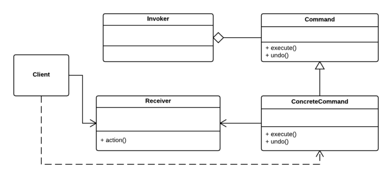

# Абстрактные классы и интерфейсы 

6.1. Stringbuilder с поддержкой операции undo

Задача
--------

Напишите свой класс StringBuilder с поддержкой операции undo. Для этого делегируйте все методы стандартному StringBuilder, а в собственном классе храните список всех операций для выполнения undo(). Это будет реализацией шаблона «Команда».

Пример паттерна "Команда". ( ´ ω ` )

Решение:
--------
    /**
    * StringBuilder с поддержкой операции undo
    * java.lang.StringBuilder — класс с модификатором <b>final</b>,
    * поэтому нет наследования, используем делегирование.
    */
    class UndoableStringBuilder {

    private interface Action{
    void undo();
    }

    private class DeleteAction implements Action{
    private int size;

         public DeleteAction(int size) {
             this.size = size;
         }

         public void undo(){
             stringBuilder.delete(
                 stringBuilder.length() - size, stringBuilder.length());
         }
    }

    private StringBuilder stringBuilder; // делегат

    /**
      * операции, обратные к выполненным.
      * То есть при вызове append, в стек помещается
      * операция "delete". При вызове undo() она
      * будет выполнена.
        */
        private Stack<Action> actions = new Stack<>();

    // конструктор
    public UndoableStringBuilder() {
    stringBuilder = new StringBuilder();
    }

    /**
    see {@link java.lang.AbstractStringBuilder#reverse()}

         После того, как сделан reverse(),
         добавляем в стек операций обратную — тоже reverse().

         Далее таким же образом.
    */
    public UndoableStringBuilder reverse() {
    stringBuilder.reverse();

         Action action = new Action(){
             public void undo() {
                 stringBuilder.reverse();
             }
         };

         actions.add(action);

         return this;
    }

    public UndoableStringBuilder append(String str) {
        stringBuilder.append(str);

        Action action = new Action(){
            public void undo() {
                stringBuilder.delete(
                        stringBuilder.length() - str.length() -1,
                        stringBuilder.length());
            }
        };

        actions.add(action);
        return this;
    }

    // ..... остальные перегруженые методы append пишутся аналогично (см. выше)......

    public UndoableStringBuilder appendCodePoint(int codePoint) {
        int lenghtBefore = stringBuilder.length();
        stringBuilder.appendCodePoint(codePoint);
        actions.add(new DeleteAction(stringBuilder.length() - lenghtBefore));
        return this;
    }

    public UndoableStringBuilder delete(int start, int end) {
        String deleted = stringBuilder.substring(start, end);
        stringBuilder.delete(start, end);
        actions.add(() -> stringBuilder.insert(start, deleted));
        return this;
    }

    public UndoableStringBuilder deleteCharAt(int index) {
        char deleted = stringBuilder.charAt(index);
        stringBuilder.deleteCharAt(index);
        actions.add(() -> stringBuilder.insert(index, deleted));
        return this;
    }

    public UndoableStringBuilder replace(int start, int end, String str) {
        String deleted = stringBuilder.substring(start, end);
        stringBuilder.replace(start, end, str);
        actions.add(() -> stringBuilder.replace(start, end, deleted));
        return this;
    }

    public UndoableStringBuilder insert(int index, char[] str, int offset, int len) {
        stringBuilder.insert(index, str, offset, len);
        actions.add(() -> stringBuilder.delete(index, len));
        return this;
    }

    public UndoableStringBuilder insert(int offset, String str) {
        stringBuilder.insert(offset, str);
        actions.add(() -> stringBuilder.delete(offset, str.length()));
        return this;
    }

    // ..... остальные перегруженные методы insert пишутся аналогично (см. выше)......

    public void undo(){
        if(!actions.isEmpty()){
            actions.pop().undo();
        }
    }

    public String toString() {
        return stringBuilder.toString();
    }
}